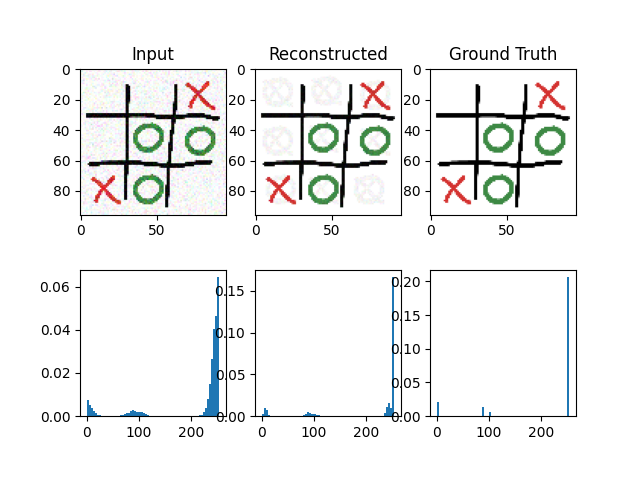
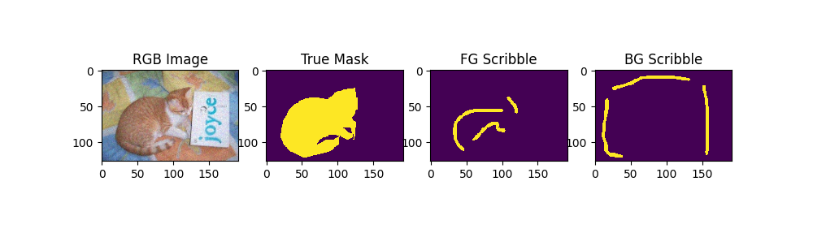
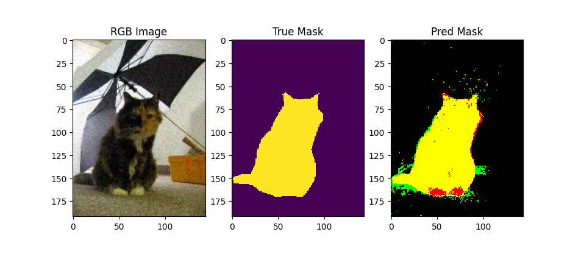

# Image Analysis and Computer Vision (IACV) - Project Portfolio

This repository contains implementations for four computer vision exercises covering fundamental and advanced techniques in image processing, segmentation, 3D reconstruction, and deep learning.


## Exercise 1: Image Compression using PCA

**Goal**: Implement lossy image compression using Principal Component Analysis (PCA) and eigenface techniques.

### Overview
This exercise focuses on dimensionally reducing images to achieve compression while maintaining visual quality. The compression leverages the insight that natural images contain redundancies that can be exploited through PCA.

### Implementation Details

#### Key Components:
1. **Training Phase** ([image_compressor.py](ex1_image_compression/image_compressor.py))
   - Computed optimal mask to identify important regions
   - Performed SVD decomposition on centered training images
   - Stored top K principal components as the codebook
   - Compressed using K=19 dimensions (from original 96×96×3 = 27,648 values)

2. **Compression Phase**
   - Applied learned mask to focus on informative pixels
   - Projected test images onto principal components
   - Generated compact K-dimensional code representation

3. **Decompression Phase**
   - Reconstructed images using weighted sum of principal components
   - Applied inverse masking to restore full image dimensions
   - Clipped values to valid pixel range [0, 255]

#### Technical Approach:
```python
# Core compression strategy:
# 1. Mask-based pixel selection (reduces dimensionality)
# 2. SVD decomposition: A = U @ S @ V^T
# 3. Compress: code = V[:K].T @ (img - mean)
# 4. Decompress: img = V[:K] @ code + mean
```

### Key Features:
- **Adaptive masking**: Automatically identifies and focuses on informative regions
- **Mean centering**: Removes DC component for better compression
- **Integer quantization**: Uses int16 for efficient storage
- **Compression ratio**: ~1:1450 (27,648 → 19 values)

### Sample Results:


---

## Exercise 2: Interactive Image Segmentation

**Goal**: Segment foreground objects from background using k-NN classification and scribble-based user interaction.

### Overview
Implemented an interactive segmentation system where users provide sparse foreground and background scribbles, and the algorithm propagates these labels to segment the entire image.

### Implementation Details

#### Key Components:
1. **Feature Extraction** ([image_segmenter.py](ex2_segmentation/image_segmenter.py))
   - Multi-dimensional feature space including:
     - **Position features**: (x, y) normalized coordinates
     - **Color features**: HSL color space (more perceptually uniform than RGB)
     - **Texture features**: Gradient-based texture descriptors
   
2. **k-NN Classification** ([kmeans.py](ex2_segmentation/kmeans.py))
   - Training set: pixels marked by user scribbles
   - Test set: all image pixels
   - Classification based on nearest neighbor voting
   - Distance metric: Euclidean in normalized feature space

3. **Feature Space Design**
   ```python
   class FeatureSpace:
       # Combines multiple feature types with adaptive weighting
       - Position: [x/W, y/H] 
       - HSL Color: [hue, saturation, lightness]
       - Texture: [gradient_x, gradient_y]
   ```

#### Algorithm Flow:
```
Input: RGB image + FG/BG scribbles
↓
Extract features for all pixels (position + HSL + texture)
↓
Normalize features to [0, 1] range
↓
Train k-NN: scribbled pixels → {FG=1, BG=0}
↓
Classify: all pixels using k-NN
↓
Output: Binary segmentation mask
```

### Sample Results:
The algorithm demonstrates robust performance on diverse image types with minimal user input required. Example workflow and results:




#### Algorithm Performance:
The k-NN based segmentation achieves high-quality results with the following characteristics:
- **Boundary Precision**: Sharp, well-defined object boundaries with minimal over/under-segmentation
- **User Efficiency**: Requires only sparse scribbles (~5-10% of image pixels) to achieve accurate segmentation
- **Robustness**: Handles objects with varying color uniformity, textures, and complex backgrounds
- **Computational Speed**: Fast inference on typical image sizes (< 1 second per image)
- **Feature Generalization**: Multi-modal features effectively capture both appearance and spatial context, reducing dependency on single feature type

### Key Features:
- **Multi-modal features**: Combines spatial, color, and texture information
- **HSL color space**: Better perceptual uniformity than RGB
- **Weighted features**: Adaptive weights balance different feature contributions
- **k-NN robustness**: Simple yet effective for this interactive setting

## Exercise 3: Stereo Vision and 3D Reconstruction

**Goal**: Reconstruct 3D scene geometry from stereo image pairs using camera calibration and triangulation.

### Overview
Implemented a complete stereo vision pipeline that takes a pair of rectified images and produces a 3D point cloud reconstruction of the scene.

### Implementation Details

#### Key Components:

1. **Camera Calibration** ([calibration.py](ex3_stereo_vision/calibration.py))
   - Computed intrinsic parameters (focal length, pixel scaling)
   - Estimated stereo baseline between cameras
   - Determined principal point coordinates

2. **Stereo Correspondence** ([stereo_3d_recon.py](ex3_stereo_vision/stereo_3d_recon.py))
   - **Patch Matching**: Used Normalized Cross-Correlation (NCC)
   - **Disparity Computation**: Found best match along epipolar lines
   - **Confidence Filtering**: Rejected low-confidence matches
   
3. **3D Triangulation**
   ```python
   def triangulate(u_left, u_right, v, calib_dict):
       # Given: pixel coordinates in left/right images
       # Output: 3D world coordinates [X, Y, Z] in mm
       
       disparity = u_left - u_right
       Z = (b * f * kx) / disparity  # Depth
       X = Z * (u_left - ox) / (f * kx)  # Horizontal position
       Y = Z * (v - oy) / (f * ky)  # Vertical position
   ```

4. **Patch Extraction** ([extract_patches.py](ex3_stereo_vision/extract_patches.py))
   - Efficient sliding window patch extraction
   - Boundary handling for image edges
   - Vectorized operations for speed

#### Algorithm Pipeline:
```
Stereo Image Pair
↓
[1] Extract patches around each pixel in left image
↓
[2] For each left patch, search along epipolar line in right image
↓
[3] Compute NCC scores for all candidates
↓
[4] Select best match → disparity
↓
[5] Triangulate: (u_left, u_right, v) → (X, Y, Z)
↓
3D Point Cloud (with confidence scores)
```

### Technical Details:

#### Normalized Cross-Correlation (NCC):
- Robust to illumination changes
- Range: [-1, 1], where 1 = perfect match
- Used for finding correspondences between image patches

#### Stereo Geometry:
- **Baseline (b)**: Distance between camera centers
- **Focal length (f)**: Camera focal length
- **Disparity**: Horizontal pixel shift between corresponding points
- **Depth**: Inversely proportional to disparity: Z ∝ 1/disparity

### Key Features:
- **Efficient patch matching**: Vectorized NCC computation
- **Epipolar constraint**: Search only along horizontal lines
- **Confidence scoring**: Output quality measure for each 3D point
- **Calibration integration**: Uses complete camera parameter set

### Sample Results:


---

## Exercise 4: Deep Learning Classification

**Goal**: Design and train a Convolutional Neural Network (CNN) for multi-class image classification.

### Overview
Implemented a CNN from scratch using PyTorch to classify images into 6 categories. The network architecture was designed to balance accuracy and computational efficiency.

### Implementation Details

#### Network Architecture ([cnn_network.py](ex4_dl_classification/cnn_network.py))

```python
class CNN(nn.Module):
    """
    Input: 3×50×50 RGB images
    Output: 6-class predictions
    """
    
    # Feature Extractor (Convolutional Blocks)
    Block 1: Conv(3→32) → BatchNorm → ReLU → MaxPool  # Output: 32×25×25
    Block 2: Conv(32→64) → Conv(64→64) → BatchNorm → ReLU → MaxPool  # Output: 64×12×12
    Block 3: Conv(64→128) → Conv(128→128) → Conv(128→128) → BatchNorm → ReLU → MaxPool  # Output: 128×6×6
    
    # Classifier (Fully Connected)
    Flatten → Linear(4608→512) → ReLU → Dropout(0.5) → Linear(512→6)
```

#### Design Decisions:

1. **Progressive Feature Learning**
   - Channels: 3 → 32 → 64 → 128 (increasing depth)
   - Spatial dimensions: 50×50 → 25×25 → 12×12 → 6×6 (decreasing)
   - Multiple conv layers per block for richer features

2. **Regularization Techniques**
   - **Batch Normalization**: Stabilizes training, enables higher learning rates
   - **Dropout (0.5)**: Prevents overfitting in classifier
   - **Data Augmentation** ([transforms.py](ex4_dl_classification/transforms.py)): Random flips, rotations, color jitter

3. **Training Configuration** ([config.py](ex4_dl_classification/config.py))
   ```python
   batch_size = 64
   learning_rate = 0.001
   momentum = 0.9
   epochs = 50
   optimizer = SGD with momentum
   loss = Cross Entropy Loss
   ```

#### Data Pipeline ([dataset.py](ex4_dl_classification/dataset.py))
- Custom PyTorch Dataset loading from HDF5
- Train/validation split for model evaluation
- Efficient batch loading with DataLoader

#### Training Strategy ([main.py](ex4_dl_classification/main.py))
```
For each epoch:
    [Training Phase]
    - Forward pass: compute predictions
    - Compute loss (CrossEntropy)
    - Backward pass: compute gradients
    - Update weights with SGD
    
    [Validation Phase]
    - Evaluate on validation set
    - Track accuracy and loss
    - Save best checkpoint
```

### Key Features:
- **Deep architecture**: 3 convolutional blocks + 2 FC layers
- **Batch normalization**: Faster convergence and better generalization
- **Data augmentation**: Increases effective dataset size
- **Checkpoint saving**: Preserves best model weights
- **Modular design**: Separate files for network, data, config, utils

### Results:
Training checkpoints and model weights saved in [ex4_dl_classification/output](ex4_dl_classification/output/).

---

## Repository Structure

```
IACV/
├── ex0_python_tutorial/         # Python basics and NumPy tutorial
├── ex1_image_compression/       # PCA-based image compression
├── ex2_segmentation/            # Interactive image segmentation
├── ex3_stereo_vision/           # Stereo 3D reconstruction
├── ex4_dl_classification/       # CNN image classification
└── README.md                    # This file
```

## Technologies Used

- **Python 3.x**: Primary programming language
- **NumPy**: Array operations and linear algebra
- **OpenCV/PIL**: Image I/O and processing
- **PyTorch**: Deep learning framework (Ex4)
- **Matplotlib**: Visualization
- **scikit-learn**: Evaluation metrics

## Key Concepts Covered

1. **Classical Computer Vision**:
   - PCA and dimensionality reduction
   - Feature extraction and matching
   - Stereo geometry and triangulation

2. **Machine Learning**:
   - k-Nearest Neighbors classification
   - Feature engineering and normalization

3. **Deep Learning**:
   - Convolutional Neural Networks
   - Training optimization and regularization
   - Data augmentation strategies

---

## Course Information

This repository contains coursework for the Image Analysis and Computer Vision course, demonstrating practical implementations of fundamental and advanced computer vision techniques.


